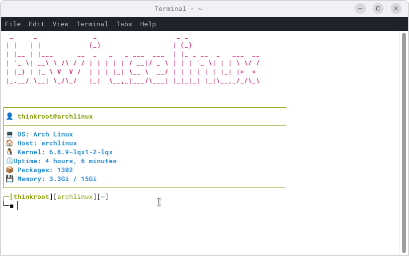

### ifetch
**A command line system information tool written in bash**



#### Introduction
This Bash script provides users with minimal information about their Linux system. It displays information such as the username, operating system, kernel version, uptime, installed packages, and used memory.

The purpose of this script is to offer a quick and simple way for Linux users to obtain information about their system.

#### Usage
To run the script, follow these steps:

1. Download the `ifetch.sh` script to your Linux system.
2. Open a terminal and navigate to the directory where you saved the script.
3. Execute the command `bash ifetch.sh` to display system information.

[Usage from any location in the terminal](utilizare.md)

#### Example Run
```bash
bash ifetch.sh
```

#### Dependencies
This script has no special dependencies. It can be run on any Linux distribution without requiring the installation of other packages or programs.

#### Compatibility
The script was created to be compatible with all major versions of Linux distributions, but it has only been tested on Arch Linux.

#### Customization
If you wish to customize the script, you can directly modify the source code to add or remove information. Make sure you have the necessary knowledge of Bash scripting to make the appropriate changes.

#### Technical Details
The script uses common commands and utilities available on most Linux distributions to collect and display system information.

#### Contribution Guide
If you wish to contribute to the development of this script, please follow these steps:

1. Fork this repository.
2. Create a new branch for your changes: `git checkout -b feature/Modifications`.
3. Make the changes and commit them: `git commit -am 'Add proposed changes'`.
4. Push your changes: `git push origin feature/Modifications`.
5. Open a Pull Request (PR) to propose the changes.

#### Licensing
This script is distributed under the [GPL 3.0 license](https://github.com/thinkroot99/ifetch?tab=GPL-3.0-1-ov-file).

#### Notes
- The script does not require special execution permissions and can be run as a regular user.
- For specific information about the commands used in the script, you can use `man` or `--help` to get more details.

This documentation provides users with detailed information about usage, contribution, and licensing, along with usage examples and important notes. It can be adapted and expanded according to your specific needs and project requirements.